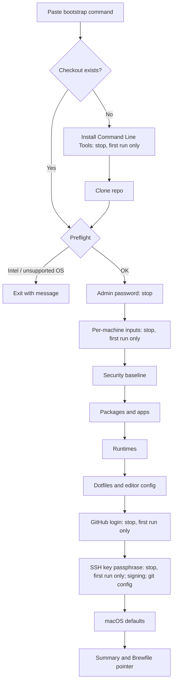

# PRD: macOS Provisioning

|  |  |
| --- | --- |
| **Status** | v1.4 — **Approved**: change requests CR-1 to CR-18 merged, 2026-09-29; Ready for development |
| **Stakeholder / sole user** | Repo owner |
| **Product owner** | Claude (mock PO exercise) |
| **Last updated** | 2026-09-29 |

---

## 1. Problem

Setting up a Mac from a fresh macOS install to a working development machine is manual, slow, and hard to reproduce. Configuration changes made directly on one machine drift away from the others and are lost on the next wipe.

## 2. Solution summary

A public GitHub repository containing a provisioning solution that takes an Apple Silicon Mac from **first desktop after Setup Assistant** to **fully configured** through one entry point. The run pauses only at human checkpoints ("manual stops").

The repository is the **source of truth for the machine's minimum configuration**. The user changes configuration by editing the repo and re-running. Every step checks current state and changes only what differs from the declared state.

## 3. Goals and success metrics

| ID | Metric | Target | How measured |
| --- | --- | --- | --- |
| M1 | ~~Fresh-run duration~~ | *Removed in v1.2* | — |
| M2 | Manual stops, fresh run | ≤ 12 | A manual stop is any point where execution halts to wait for user input. A bail-out that requires a re-run counts as one stop. Manual setup noted in the Brewfile (FR-13) is excluded. |
| M3 | Convergence (the machine already matches the declared state, so a second run finds nothing to change) | Second consecutive run makes 0 changes other than upstream releases, and has 0 manual stops | Run summary output (FR-15.3). |
| M4 | Settings take effect | 100% of declared settings verified effective on the verified-tier macOS version (NFR-5) | Verification evidence per setting (§8.4), collected on the stakeholder's Mac on its installed version. Settings not verifiable there are listed as unverified in the repo. |

## 4. User and context

- One user: the repo owner. Competent with a terminal.
- Personal Macs only, none managed by an employer's MDM (Mobile Device Management).
- **Apple Silicon only.**
- One admin account per machine.
- All machines share one configuration profile but have distinct identities: computer name and SSH key.
- Documents live in iCloud Drive.
- The repo is public and doubles as a portfolio piece for prospective employers.

## 5. Scope

### 5.1 In scope

- Bootstrap from a single pasteable command.
- Preflight checks, including OS version and permissions.
- Security baseline: FileVault check and firewall.
- CLI packages and GUI apps.
- Language runtimes: Node and Python.
- Shell configuration and dotfiles.
- Editor configuration: Neovim. VS Code configuration is handled by its own Settings Sync (FR-8.4).
- Per-machine SSH key, GitHub registration, git identity, and SSH commit signing.
- macOS system and app defaults.
- iCloud sign-in reminder (FR-13.1).
- Manual app setup notes, kept as comments in the Brewfile (FR-13).
- Check mode: a read-only preview of what a run would change (FR-16).

### 5.2 Non-goals (explicitly excluded)

| Excluded | Notes |
| --- | --- |
| Intel Macs |  |
| Mac App Store apps |  |
| Fonts |  |
| Company-managed machines | MDM |
| Multiple user accounts per machine |  |
| Linux or any other OS |  |
| Backups | Data availability is delegated to iCloud Drive. |
| Migrating away from Bitwarden |  |
| Removing or resetting anything not declared in config | The config is a minimum, not a mirror. |
| Declaring items as "must be absent" |  |
| Automating app sign-ins, license entry, or app permission grants | These are noted as Brewfile comments (FR-13). |
| Fetching secrets at run time | None are required in v1. |
| macOS updates, minor or major | The README instructs the user to update macOS before running. |
| Managing VS Code settings or extensions | VS Code Settings Sync owns them. |
| Duration targets | Removed in v1.2. |
| Log files | Terminal output only. |

## 6. Functional requirements

Priority key: **MUST** = v1 release blocker. **SHOULD** = v1 unless it blocks the timeline.

### FR-1 Bootstrap

- **FR-1.1 (MUST)** A single command, pasted into the stock Terminal app, starts provisioning on a freshly installed macOS. It fetches the solution from the public GitHub repo.
- **FR-1.2 (MUST)** The bootstrap uses only tools bundled with macOS until it has installed the Xcode Command Line Tools. It then clones the repository with git into the checkout location. Installing the Command Line Tools opens Apple's installer dialog: one manual stop, first run only.
- **FR-1.3 (MUST)** The same entry point is used for fresh runs and re-runs. Re-running on a provisioned machine is the normal way to apply config changes. When a local checkout already exists, the bootstrap command runs **that checkout as it stands**, including uncommitted edits, and never pulls from GitHub. The user pulls when they choose.

*Acceptance:* On a freshly installed supported macOS, pasting the documented command from the README starts the run with no prior manual installs.

### FR-2 Preflight

The run stops before making any changes if a preflight check fails. Exception: the bootstrap may already have installed the Xcode Command Line Tools (FR-1.2).

- **FR-2.1 (MUST)** Verify Apple Silicon. On Intel, exit with a clear message.
- **FR-2.2 (MUST)** Verify the macOS version is in the verified or tolerated tier (NFR-5). Otherwise, exit with a message.
- **FR-2.3 (MUST)** Request the admin password once. Admin privileges persist for the whole run so there is no second password prompt.
- ~~FR-2.4, FR-2.5~~ *Removed in v1.4 (CR-13, CR-12).*

*Acceptance:* Each failing condition produces a named, actionable message and a non-zero exit, and no system changes are made.

### FR-3 Per-machine inputs

- **FR-3.1 (MUST)** Per-machine, non-secret settings live in a `.env` file at the repo root. It is listed in `.gitignore`. A committed `.env.example` documents every key with a comment. Keys:
  - `COMPUTER_NAME`
  - `GIT_AUTHOR_NAME`
  - `GIT_AUTHOR_EMAIL`, defaulting to the GitHub no-reply address (FR-9.4)
- **FR-3.2 (MUST)** On any run, prompt in a **single** stop for every key that is missing or empty in `.env`, and write the answers to `.env`. If all keys are present, do not prompt.
- **FR-3.3 (MUST)** Apply the computer name to all of the machine's name identifiers (computer name, local hostname, hostname).
- **FR-3.4 (MUST)** Editing a value in `.env` and re-running applies the new value (e.g., renames the machine). `.env` is the source of truth for these settings, as the repo is for everything else.
- **FR-3.5 (MUST)** `.env` never holds secrets. The only secret in v1, the SSH key passphrase, lives in the macOS Keychain (FR-9.5).

*Acceptance:* A second run asks no questions. `git status` never shows `.env`. Changing `COMPUTER_NAME` and re-running renames the machine.

### ~~FR-4 macOS updates~~

*Removed in v1.4 (CR-13). The README instructs the user to update macOS before running.*

### FR-5 Security baseline

- **FR-5.1 (MUST)** Check whether FileVault is enabled. If not, print a prominent warning with instructions. The script does not enable FileVault itself.
- **FR-5.2 (MUST)** Enable the macOS application firewall if it is not already on.

### FR-6 Packages and apps

- **FR-6.1 (MUST)** Install every item in the package inventory (§8.1) that is not already installed.
- **FR-6.2 (MUST)** A single declarative manifest in the repo lists all packages. Adding an item to it and re-running is the only step needed to install new software.
- **FR-6.3 (MUST)** Homebrew itself is installed and usable from the user's shell as an end-state outcome.
- ~~FR-6.4, FR-6.5~~ *Removed in v1.2 (served only M1).*

### FR-7 Language runtimes

**Division of labor:**

- **mise** is the single owner of language *interpreters* (Node and Python).
- **uv** owns everything *inside* Python: packages, virtual environments, lockfiles, and Python CLI tools.

One owner per layer avoids two copies of each Python version and ambiguity about which one is on PATH.

- **FR-7.1 (MUST)** Node.js majors **22, 24, 26** are installed through **mise**, each at its latest patch at install time.
- **FR-7.2 (MUST)** Python **3.12 and 3.14** are installed through **mise**, each at its latest patch at install time.
- **FR-7.3 (MUST)** Global default versions (A5) are declared in mise's global config file, a repo-managed dotfile (§8.3). mise is activated in zsh so the defaults apply in every new shell.
- **FR-7.4 (MUST)** uv uses mise's interpreters and never downloads its own. The intended settings are uv's `python-downloads = "never"` and `python-preference = "only-system"`; the dev team confirms these against current uv documentation.

  *Rationale:* mise's docs warn that uv, given only a version number, may pick a different interpreter of the same version.
- **FR-7.5 (MUST)** Entering a uv project directory (one with a `uv.lock`) automatically activates its existing virtual environment, via mise's `python.uv_venv_auto = "source"`.

  *Note for the dev team:* the legacy value `true` is deprecated as of mise 2026.7 and scheduled for removal in 2027.7.
- **FR-7.6 (SHOULD)** mise reads a project's `.python-version` file (`idiomatic_version_file_enable_tools = ["python"]`), so uv and mise agree on a project's Python version without duplicate config.

### FR-8 Shell, dotfiles, editors

- **FR-8.1 (MUST)** zsh is the login shell, with **antidote** (plugin manager), **starship** (prompt) and **zoxide** (directory jumping) configured and active in new shells.
- **FR-8.2 (MUST)** Config files live in the repo and are **linked**, not copied, into their expected locations. An edit to the live file therefore shows up as a change in `git status`. Covered files are listed in §8.3.
- **FR-8.3 (MUST)** If a regular file already exists at a link target, back it up with a timestamped name before linking. Never delete it. Log a `WARN` line naming the original path and the backup path (§8.5).
- **FR-8.4 (MUST)** VS Code settings, keybindings and extensions are **not** managed by this solution; VS Code's built-in Settings Sync owns them. The script installs VS Code only. Turning on Settings Sync is noted in the Brewfile (FR-13).
- **FR-8.5 (MUST)** Neovim and Ghostty configs are applied through FR-8.2.
- **FR-8.6 (MUST)** Each config file in §8.3 contains its **required block** only, preceded by a header comment naming the tool and linking to its official settings reference. A file with no required content ships as the header alone.

  *Acceptance:* each tool starts with its file with no errors or warnings.

### FR-9 Git, SSH, GitHub identity

- **FR-9.1 (MUST)** Generate a new SSH key for each machine if none exists. The key comment includes the computer name.
- **FR-9.2 (MUST)** Authenticate to GitHub through a browser-based login. This is one manual stop.
- **FR-9.3 (MUST)** Register the machine's public key with GitHub as **both** an authentication key and a signing key. Skip registration if the key is already registered.
- **FR-9.4 (MUST)** Configure git with:
  - the author name from FR-3;
  - the author email defaulting to GitHub's no-reply address (`ID+USERNAME@users.noreply.github.com`);
  - SSH commit signing turned on for all commits.
- **FR-9.5 (MUST)** The SSH key is protected by a passphrase entered by the user at generation (one manual stop, first run only). The passphrase is stored in the macOS Keychain so it is never requested again for normal use. *(Resolves OQ-2.)*

*Acceptance:* A commit made on a newly provisioned machine and pushed to GitHub shows as **Verified**. `ssh -T git@github.com` authenticates.

### FR-10 macOS defaults

- **FR-10.1 (MUST)** Apply every setting in §8.4. The **Intent** column is the requirement. The domain and key are the stakeholder's current implementation and may be replaced by whatever mechanism achieves the intent on each supported macOS.
- **FR-10.2 (MUST)** A setting is "done" only when its **effect** has been verified on each supported macOS version (M4). A successful write alone does not count.
- **FR-10.3 (MUST)** After applying settings, restart affected system processes such as the Dock and Finder so changes appear without a logout. If a setting needs a logout or restart to take effect, say so in the run summary.
- **FR-10.4 (MUST)** Create the screenshot directory (`~/Desktop/Screenshots`) if it is missing.

### ~~FR-11 iCloud~~

*Removed in v1.4 (CR-17). The iCloud sign-in reminder is part of FR-13.1.*

### FR-12 Upgrade mode

- ~~FR-12.1~~ *Removed in v1.4 (CR-11).*
- **FR-12.2 (MUST)** Homebrew items follow Homebrew Bundle's default behavior and are upgraded on every run. An explicit, documented upgrade option upgrades mise-managed runtimes:
  - Node versions to the latest patch within each declared major;
  - Python versions to the latest patch within each declared minor.

  Without that option, runtimes are only installed when missing.

### FR-13 Manual setup notes

- **FR-13.1 (MUST)** Manual setup steps are kept as comments in the `Brewfile`: per-package notes next to their entries, and a header comment for reminders not tied to a package, including signing in to iCloud. At the end of a successful run, print one `NOTE` line directing the user to these comments. At minimum the notes cover:
  - grant Accessibility to Rectangle;
  - grant Accessibility and Screen Recording to Bartender, and enter its license;
  - complete Docker Desktop's first launch;
  - sign in to VS Code and turn on Settings Sync;
  - sign in to Bitwarden, Chrome, Microsoft Office, Notion and Spotify;
  - sign in to iCloud.
- ~~FR-13.2~~ *Removed in v1.4 (CR-8).*

### FR-14 Idempotency and state semantics

- **FR-14.1 (MUST)** Every step checks current state first and makes a change only when state differs from the declaration.
- **FR-14.2 (MUST)** Nothing present on the machine but absent from the config is removed, reset or modified.
- **FR-14.3 (MUST)** Interrupting a run at any point and re-running it converges to the same end state.

### FR-15 Errors and logging

- **FR-15.1 (MUST)** On any failure, exit gracefully with a non-zero status and a `FAIL` line naming the failed step and the likely remedy. The user fixes the cause and re-runs; no separate resume mechanism is required.
- **FR-15.2 (MUST)** Output goes to the terminal only. No log files are written.
- **FR-15.3 (MUST)** End every run with a summary: counts of items changed, already correct, and failed; any logout notices; then the Brewfile pointer (FR-13.1).
- **FR-15.4 (MUST)** Every line follows the anatomy, status vocabulary and phrasing rules in §8.5. Exception: output from Homebrew commands (the Homebrew installer and `brew bundle`) passes through unmodified between the `brew` module's start and finish headers. The module reports the Brewfile as a single item.
- **FR-15.5 (MUST)** Every module opens with a start header and closes with a finish header carrying its counts.
- **FR-15.6 (MUST)** macOS settings use the compact one-line form in §8.5: descriptor, current value, desired value, and result.
- **FR-15.7 (MUST)** Color follows §8.5. It is disabled when output is not a terminal or `NO_COLOR` is set.
- **FR-15.8 (MUST)** Secrets and passphrases never appear in output.

### FR-16 Check mode

- **FR-16.1 (SHOULD)** A documented check option runs every check and no apply step. It makes no changes and has no manual stops. Items that would change are reported with the `DIFF` status (§8.5). The summary reports how many items would change.

## 7. Run flow



Estimated fresh-run stops: Command Line Tools installer (1), admin password (1), inputs (1), GitHub login (1), SSH passphrase (1). That is 5, against a budget of 12. The dev team must measure the real figure.

## 8. Desired-state inventory

### 8.1 Packages and apps

The item name is the stakeholder's identifier. The dev team verifies the exact Homebrew formula or cask name. Post-run notes are recorded as comments in the `Brewfile` (FR-13.1).

| Item | Kind | Post-run note |
| --- | --- | --- |
| git | CLI |  |
| uv | CLI | Python packages and environments (FR-7) |
| zsh | Shell | See A4 |
| starship | CLI |  |
| antidote | CLI |  |
| zoxide | CLI |  |
| neovim | CLI |  |
| mise | CLI | Runtime manager (FR-7) |
| ghostty | GUI |  |
| visual-studio-code | GUI | Settings Sync sign-in |
| docker (Docker Desktop) | GUI | First launch needs user approval |
| chrome | GUI | Sign-in |
| duckduckgo | GUI |  |
| spotify | GUI | Sign-in |
| microsoft-office | GUI | Sign-in; large download |
| bitwarden | GUI | Sign-in |
| notion | GUI | Sign-in |
| rectangle | GUI | Accessibility permission |
| bartender | GUI | Accessibility and Screen Recording permissions; license |

### 8.2 Runtimes

| Runtime | Manager | Versions | Default |
| --- | --- | --- | --- |
| Node.js | mise | 22, 24, 26 | 24 (A5) |
| Python | mise (interpreters); uv (packages, venvs) | 3.12, 3.14 | 3.14 (A5) |

### 8.3 Config files

Every file below ships with its required content only, under a header comment (FR-8.6). The stakeholder may replace or extend any file at any time; that is an ordinary repo change, not a release dependency.

| Tool | Config | Required active content |
| --- | --- | --- |
| zsh | `.zshrc` (+ `.zprofile` if needed) | mise activation, starship init, zoxide init, antidote plugin loading (FR-7.3, FR-8.1) |
| antidote | plugin list | None; commented example plugins only |
| starship | `starship.toml` | None |
| Ghostty | Ghostty config | None |
| Neovim | `~/.config/nvim` | None |
| mise | global config | Node and Python versions and defaults; `uv_venv_auto`; `.python-version` discovery (FR-7) |
| uv | global config | Download and interpreter-preference settings (FR-7.4) |
| git | generated from template + `.env` | Identity and SSH commit signing (FR-9.4) |

### 8.4 macOS settings

All values are the stakeholder's. "⚠" marks settings suspected to be ineffective on current macOS or written to an uncommon key. These are *suspicions to verify, not verdicts*. Every row requires effect verification (FR-10.2).

| Area | Intent | Current domain / key | Value | Flag |
| --- | --- | --- | --- | --- |
| Dock | Icon size 48 px | `com.apple.dock` `tilesize` | int 48 |  |
| Dock | Auto-hide | `com.apple.dock` `autohide` | true |  |
| Dock | No auto-hide delay | `com.apple.dock` `autohide-delay` | float 0 |  |
| Dock | Faster hide animation | `com.apple.dock` `autohide-time-modifier` | float 0.25 |  |
| Dock | Hide recent apps | `com.apple.dock` `show-recents` | false |  |
| Dock | Scale minimize effect | `com.apple.dock` `mineffect` | scale |  |
| Spaces | Don't reorder Spaces by use | `com.apple.dock` `mru-spaces` | false | Declared twice in the source; keep once |
| Finder | Show all file extensions | `com.apple.finder` `AppleShowAllExtensions` | true | ⚠ commonly `NSGlobalDomain` |
| Finder | Show path bar | `com.apple.finder` `ShowPathbar` | true |  |
| Finder | Show status bar | `com.apple.finder` `ShowStatusBar` | true |  |
| Finder | Full path in window title | `com.apple.finder` `UseFullPathInTitle` | true | ⚠ commonly `_FXShowPosixPathInTitle` |
| Finder | Search current folder by default | `com.apple.finder` `FXDefaultSearchScope` | SCcf |  |
| Finder | No extension-change warning | `com.apple.finder` `FXEnableExtensionChangeWarning` | false |  |
| Finder | No .DS_Store on network volumes | `com.apple.desktopservices` `DSDontWriteNetworkStores` | true |  |
| Finder | No .DS_Store on USB volumes | `com.apple.desktopservices` `DSDontWriteUSBStores` | true |  |
| Finder | List view default | `com.apple.finder` `FXPreferredViewStyle` | Nlsv |  |
| Finder | Folders first when sorting | `com.apple.finder` `FXSortFoldersFirst` | true | ⚠ commonly `_FXSortFoldersFirst` |
| Finder | Show hidden files | `com.apple.finder` `AppleShowAllFiles` | true |  |
| Finder | New window opens home | `com.apple.finder` `NewWindowTarget` | PfHm |  |
| Menu bar | Clock shows seconds | `com.apple.menuextra.clock` `ShowSeconds` | true |  |
| Menu bar | 24-hour clock | `com.apple.menuextra.clock` `Show24Hour` | true |  |
| Keyboard | Fast key repeat | `NSGlobalDomain` `KeyRepeat` | int 2 |  |
| Keyboard | Short repeat delay | `NSGlobalDomain` `InitialKeyRepeat` | int 15 |  |
| Keyboard | No autocorrect | `NSGlobalDomain` `NSAutomaticSpellingCorrectionEnabled` | false |  |
| Keyboard | No auto-capitalization | `NSGlobalDomain` `NSAutomaticCapitalizationEnabled` | false |  |
| Keyboard | No smart dashes | `NSGlobalDomain` `NSAutomaticDashSubstitutionEnabled` | false |  |
| Keyboard | No smart quotes | `NSGlobalDomain` `NSAutomaticQuoteSubstitutionEnabled` | false |  |
| Keyboard | No double-space period | `NSGlobalDomain` `NSAutomaticPeriodSubstitutionEnabled` | false |  |
| Keyboard | Full keyboard access | `NSGlobalDomain` `AppleKeyboardUIMode` | int 3 |  |
| Trackpad | Tap to click | `com.apple.driver.AppleBluetoothMultitouch.trackpad` `Clicking`; `com.apple.AppleMultitouchTrackpad` `Clicking`; `NSGlobalDomain` `com.apple.mouse.tapBehavior` | true / true / int 1 |  |
| Trackpad | Tracking speed | `NSGlobalDomain` `com.apple.trackpad.scaling` | float 2 |  |
| Trackpad | Three-finger drag | `…AppleBluetoothMultitouch.trackpad` and `com.apple.AppleMultitouchTrackpad` `TrackpadThreeFingerDrag` | true | May need logout |
| Screenshots | Save to `~/Desktop/Screenshots` | `com.apple.screencapture` `location` | path |  |
| Screenshots | PNG format | `com.apple.screencapture` `type` | png |  |
| Screenshots | No floating thumbnail | `com.apple.screencapture` `show-thumbnail` | false |  |
| Mission Control | Faster animation | `com.apple.dock` `expose-animation-duration` | float 0.1 |  |
| Mission Control | Group windows by app | `com.apple.dock` `expose-group-by-app` | true |  |
| TextEdit | Plain text by default | `com.apple.TextEdit` `RichText` | int 0 |  |
| TextEdit | UTF-8 open/save | `com.apple.TextEdit` `PlainTextEncoding`, `PlainTextEncodingForWrite` | int 4 |  |
| Activity Monitor | Show all processes | `com.apple.ActivityMonitor` `ShowCategory` | int 0 |  |
| Activity Monitor | Sort by CPU | `com.apple.ActivityMonitor` `SortColumn`, `SortDirection` | CPUUsage, int 0 |  |

### 8.5 Logging specification

All output goes to the terminal. There are no log files (FR-15.2).

**Line anatomy.** Every line has the same four columns:

```
HH:MM:SS  STATUS   [module]  subject: message
```

| Column | Rule |
| --- | --- |
| Time | Local, 24-hour, on every line including headers |
| STATUS | A fixed-width tag from the vocabulary below. It carries the meaning on its own; color only reinforces it. |
| module | A dotted scope such as `brew`, `runtimes`, `dotfiles`, `git`, `defaults.dock` |
| subject | The thing being managed (package, file, setting), always first and always the same noun |

**Status vocabulary.** Tense encodes where the item is in its lifecycle:

| Event | STATUS | Color | Phrasing rule | Example message |
| --- | --- | --- | --- | --- |
| Module start | `▶` | bold | `start — <n> items` | `start — 19 items` |
| Already correct (no-op) | `OK` | dim | `already <state> — skipping` | `git: already installed — skipping` |
| Changed and verified | `CHANGED` | green | past tense, then `— verified` (from a read-back of real state) | `neovim: installed — verified` |
| Check mode: item would change | `DIFF` | cyan | observed state, then `— would change` | `Screenshots folder: missing — would change` |
| Failure | `FAIL` | red | `expected <x>, found <y> — <remedy>` or `<what failed> — <remedy>` | `neovim: expected installed, found missing — run brew doctor, then re-run` |
| Warning | `WARN` | yellow | what happened, and where | `~/.zshrc: existing file backed up to ~/.zshrc.bak-<timestamp>` |
| Manual stop | `ACTION` | magenta, bold | imperative: what to do, then how to continue | `Sign in to GitHub in the browser window that just opened, then press Enter.` |
| Neutral information | `NOTE` | none | plain statement | `Per-package setup notes: see comments in ~/.dotfiles/Brewfile` |
| Module finish | `■` | bold | `finish — <c> changed · <o> ok · <f> failed` | `finish — 1 changed · 18 ok · 0 failed` |

**Rules**

- **Line counts.** Every managed item emits exactly **one** line: `OK` if already correct, `CHANGED` if applied and the read-back confirms it, `DIFF` in check mode, or `FAIL`. On a converged machine the output is a quiet column of dim `OK`s, so anything in color needs attention.
- **`CHANGED` means verified.** It is printed only after reading the state back confirmed the effect (see M4). A command that succeeded without the effect is a `FAIL`.
- **Color is used only when output is a terminal (TTY) and `NO_COLOR` is unset** (the no-color.org convention). Without color, every line still reads correctly from its STATUS tag.
- **`FAIL` lines go to stderr.** All other lines go to stdout.
- **Secrets never appear in output.** Passphrase entry does not echo.
- **The run ends with a summary**: totals across modules, any logout notices, then the Brewfile pointer (FR-13.1).

**macOS defaults: compact form.** Writing a setting is instant, so check, action and verification merge into **one line per setting**:

```
HH:MM:SS  STATUS   [defaults.<area>]  <Intent label> ....  <current> → <desired>   <result>
```

| Element | Rule |
| --- | --- |
| STATUS | `OK` if current equals desired, so nothing is written. `CHANGED` if written and the read-back equals desired. `DIFF` in check mode when current differs from desired. `FAIL` if the read-back differs from desired. |
| Intent label | The Intent column of §8.4, dot-padded so the arrows align |
| Values | Shown as read, with type. A missing key shows as `(unset)`. |
| Result | `no change`, `verified`, `verified · needs logout`, `would change` (check mode), or `read-back: <value>` (on FAIL) |

**Illustrative excerpt** (values are examples, not measurements):

```
10:41:02  ▶        [dotfiles]        start — 9 items
10:41:02  OK       [dotfiles]        ~/.config/starship.toml: already linked — skipping
10:41:02  WARN     [dotfiles]        ~/.zshrc: existing file backed up to ~/.zshrc.bak-20260927-104102
10:41:02  CHANGED  [dotfiles]        ~/.zshrc: linked — verified
10:41:03  ■        [dotfiles]        finish — 1 changed · 8 ok · 0 failed
10:41:40  ▶        [defaults.dock]   start — 7 settings
10:41:40  OK       [defaults.dock]   Icon size ..........  48 → 48            no change
10:41:40  CHANGED  [defaults.dock]   Auto-hide delay ....  0.5 → 0            verified
10:41:40  CHANGED  [defaults.dock]   Hide recent apps ...  (unset) → false    verified
10:41:41  ■        [defaults.dock]   finish — 2 changed · 5 ok · 0 failed
10:41:42  NOTE     [summary]         Per-package setup notes: see comments in ~/.dotfiles/Brewfile
```

## 9. Non-functional requirements

- ~~NFR-1 Performance~~ *Removed in v1.2 (served only M1).*
- **NFR-2 Interaction budget:** M2 (≤ 12 stops). Every stop explains what the user must do and why.
- **NFR-3 Security and privacy:**
  - No secrets in the repo or its history.
  - No personal identifiers other than the GitHub username. The git email is the no-reply address.
  - `.env` is gitignored, and no log files are written (FR-15.2).
- **NFR-4 Maintainability:** Adding a package, app, runtime version or setting means editing one declarative file or table entry. No logic changes are needed.
- **NFR-5 Compatibility:** Supported: Apple Silicon on macOS **Golden Gate (27)**, the *verified tier*, and **Tahoe (26)**, the *tolerated tier*. A version enters the verified tier only after M4 verification passes on it. On a tolerated version, preflight prints a `WARN` that the version is unverified, then continues.
- **NFR-6 Portfolio quality:** The repo is public-facing. Code and docs must read as professional work (see DoD).

## 10. Assumptions

The stakeholder may override any of these. Silence means accepted.

| ID | Assumption |
| --- | --- |
| A1 | The user installs software and changes settings **only** by editing the repo and re-running. Direct changes are neither detected nor reported. |
| A2 | ~~Fresh-run clock~~ *Removed in v1.2 with M1.* |
| A3 | App sign-ins, licenses and permission grants happen after the run, using the Brewfile notes (FR-13). |
| A4 | The macOS-bundled zsh is the login shell. A Homebrew-installed zsh is not required unless the stakeholder says otherwise. |
| A5 | The default Node is 24 (current LTS). The default `python3` on PATH is mise-managed 3.14. |
| A6 | Tooling the solution installs for its own use (e.g., GitHub CLI) may remain installed. Its presence is not a defect. |

## 11. Dependencies

| ID | Dependency | Owner | Needed by |
| --- | --- | --- | --- |
| D1 | ~~Stakeholder config files~~ *Replaced in v1.3 by dev-team templates (FR-8.6)* | — | — |
| D2 | ~~VS Code extension list~~ *Removed in v1.2 (Settings Sync)* | — | — |
| D3 | ~~A wipeable test Mac per supported version~~ Resolved v1.4: the stakeholder's single Mac, on the verified-tier macOS version. Not wipeable during development. No virtual machines. | Stakeholder | Verification |

## 12. Risks

| Risk | Impact | Mitigation |
| --- | --- | --- |
| Apple changes or retires defaults keys between releases | Settings silently do nothing (M4) | Intent-based requirements (FR-10.1); per-version verification; the supported-version gate (NFR-5) |
| VS Code config lives in Settings Sync, not the repo | Not version-controlled or reviewable; invisible to portfolio readers | Accepted by stakeholder (v1.2) |
| Terminal-only output | A failure's details are lost once the terminal window closes | Accepted; the user can pipe output through `tee` for a given run |
| uv picks a different interpreter than mise | A project runs on an unexpected Python | FR-7.4 prevents uv from obtaining its own interpreters |

## 13. Open questions

| ID | Question | Resolution |
| --- | --- | --- |
| OQ-1 | Major-upgrade bail-out vs. Sequoia support | **Resolved v1.1:** bail out only if the available major version is on the supported list; otherwise warn and continue (FR-2.4). **Superseded v1.4:** FR-2.4 removed (CR-13). |
| OQ-2 | SSH key passphrase | **Resolved v1.1:** passphrase stored in the macOS Keychain; +1 stop (FR-9.5). |
| OQ-3 | mise/uv division of labor | **Resolved v1.3:** accepted as specified in FR-7. Rejected alternative: uv owns Python interpreters and mise only Node, which splits runtime versions across two tools' configs. |
| OQ-4 | Logging specification | **Resolved v1.3:** accepted as specified in §8.5 and FR-15. |

No open questions remain.

## 14. Definition of Ready (gate for dev team acceptance)

| Criterion | Status |
| --- | --- |
| Problem, goals and measurable success metrics stated | ✅ |
| Scope and explicit non-goals stated | ✅ |
| Every MUST requirement has testable acceptance criteria | ✅ |
| Desired-state inventory complete | ✅ |
| Assumptions explicit | ✅ |
| Open questions resolved | ✅ |
| Dependencies and risks identified | ✅ |
| Stakeholder sign-off | ✅ v1.3, 2026-09-27 |

## 15. Definition of Done (gate for v1 release)

- [ ] All MUST requirements pass their acceptance criteria on the stakeholder's Mac. Fresh-run criteria (FR-1.1, M2) are measured during the release wipe below.
- [ ] M2 and M3 measured and met; results recorded in the repo.
- [ ] M4: each §8.4 setting verified effective on the verified-tier version, with evidence recorded. Ineffective settings are fixed or explicitly dropped with stakeholder approval.
- [ ] Every script passes `zsh -n`, and the fixture test suite passes.
- [ ] Every §8.3 file meets FR-8.6.
- [ ] README covers:
  - what the solution does
  - design principles (minimum-not-mirror, idempotency)
  - the instruction to update macOS before running
  - the bootstrap command
  - the upgrade option and the check option
  - the expected manual stops
  - how to add a package or setting
- [ ] No secrets or personal identifiers in the repo or its history (NFR-3).
- [ ] Release acceptance: one planned wipe-and-provision of the stakeholder's Mac. Before the wipe, iCloud Drive is fully synced and one Time Machine backup exists. FR-1.1 acceptance and M2 are measured during this run.

## 16. Later (not v1)

- CI (automated checks on every push) running provisioning on GitHub-hosted Apple Silicon macOS runners.
- Drift report: list installed items not declared in config.
- Local git verification of SSH-signed commits (allowed-signers file).
- Run-time secret retrieval from Bitwarden (`bw` CLI), if a future secret needs it.

## 17. Changelog

| Version | Date | Change |
| --- | --- | --- |
| 1.0 | 2026-09-26 | First draft from stakeholder interview rounds 1–3. |
| 1.1 | 2026-09-26 | Resolved OQ-1 (FR-2.4) and OQ-2 (FR-9.5). A2 changed: Office excluded from M1 via new FR-6.4/6.5. Stop estimate raised to about 7. |
| 1.2 | 2026-09-27 | Removed M1, A2, NFR-1, FR-6.4/6.5. nvm → mise, with the mise/uv split in FR-7 (OQ-3). FR-3 specifies `.env`. FR-8.3 logs a warning. VS Code moved to Settings Sync (FR-8.4; D2 removed). Logging rewritten (FR-15, §8.5; OQ-4). |
| 1.3 | 2026-09-27 | Resolved OQ-3, OQ-4. D1 replaced by dev-team config templates (FR-8.6 rewritten, §8.3 restructured). Status: Ready for sign-off. |
| 1.3 | 2026-09-27 | Stakeholder sign-off recorded. No content changes. |
| 1.4 | 2026-09-29 | Merged change requests CR-1 to CR-18 from chartering (`docs/prd-v1.4-change-requests.md`; CR-3 withdrawn). Supported versions 26/27 in two tiers; single-Mac testing and release wipe; check mode (FR-16); Brewfile notes replace the checklist; Homebrew upgrades every run; zsh gate replaces shellcheck; removed FR-2.4, FR-2.5, FR-4, FR-11, FR-12.1, FR-13.2; slimmer templates (FR-8.6); clone-based bootstrap; six §8.4 rows removed; reduced §8.5 vocabulary. |